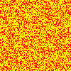
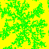

# MarkovSystem_DendriteGrowth
Simple cli program written on c++ to generate png images of Markovs systems called dendrite growth with given parameters.
## Compilation
Make sure that you have libpng installed
```
$> g++ -lpng main.c
```
## Usage
Simply launch application in comand line and you will be asked for parameters, after which two images will be generated in current directory - seed.png (random filled map with seed in the middle of it, that the algorythm will work on) and the result.png.
##### example seed.png

##### example result.png

## Examples 
##### 200x200 30000 iterations 26% fill
.png)
##### 600x600 20000 iterations 26% fill
.png)
##### 600x600 20000 iterations 40% fill
.png)
